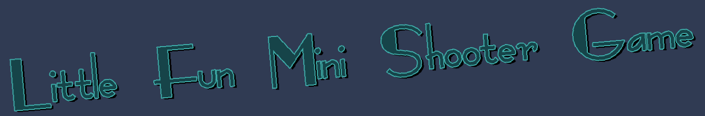
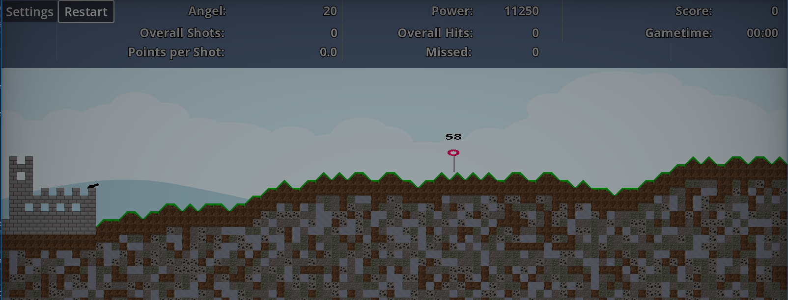
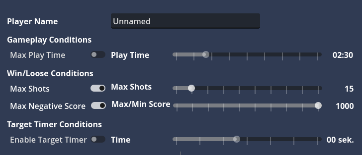

[](https://github.com/Coding-4Fun/Just4Fun_Mini_Shootergame/actions/workflows/export.yml)
[](https://godotengine.org)
[](LICENSE)



# Just4Fun_Mini_Shootergame

Ein dynamisches 2D-Shooter-Spiel im Godot Engine, bei dem der Spieler als Kanone fungiert und zufällig generierte Ziele treffen muss. Was ursprünglich als Prototyp begann, hat sich zu einem vollständigen Mini-Spiel mit verschiedenen Einstellungen und Spielmodi entwickelt.



---

## 🎮 Spieldescription

Der Spieler steuert eine Kanone am linken Bildschirmrand und muss zufällig platzierte Ziele auf einer prozedural generierten Terrain treffen.

### Steuerung
- **Maus bewegen**: Schusswinkel anpassen
- **Mausrad**: Schussgenauigkeit einstellen (7500 - 30000)
  - Änderung: ±100 normal, ±1000 mit STRG
- **Linke Maustaste**: Schuss abfeuern (mit Cooldown-Timer)
- **ESC**: Pausemenü öffnen

### Spielmechaniken
- **Ziele**: Erscheinen zufällig auf dem Spielfeld, geben variable Punkte bei Treffer
- **Timeout-System**: Optional aktivierbar - Ziele verschwinden nach Zeit und generieren sich neu
- **Score-System**: 
  - Positive Punkte bei Treffer
  - Negative Punkte bei Fehlschuss (-2)
- **Terrain-Generierung**: Mit optionalem Seed für reproduzierbare Levels
- **Vignetten-Effekt**: Visuelles Feedback für Treffer/Fehlschüsse
- **Floating Text**: Punkt- und Reload-Anzeige

---

## ⚙️ Einstellungen & Features

### Spieloptionen
- ✅ **Reload-Cooldown Timer**: Einstellbar mit Countdown-Anzeige
- ✅ **Spielername**: Speicherbar für zukünftige Highscores
- ✅ **DummyTarget Timer**: Ein-/Ausschalten
- ✅ **Schussanzahl-Limite**: Wahlweise aktivierbar
- ✅ **Punktziel**: Positive oder negative Punktziele definierbar
- ✅ **Terrain Seed**: Manuelle oder automatische Seed-Generierung

### Menüstruktur
- **Hauptmenü**: Play-Button, Einstellungen
- **Pausemenü** (ESC):
  - Fortsetzen
  - Level neustarten
  - Neues Level generieren
  - Zu Einstellungen
  - Zurück zum Hauptmenü
  - Spiel beenden
- **Einstellungen**: Spielparameter konfigurieren
- **Game Over Dialog**: Score-Anzeige und Neustart



---

## 🎯 Aktuelle Features (Stand: Februar 2026)

### Technologien
- **Engine**: Godot 4.6 stable
- **Sprache**: GDScript
- **Platform-Export**: Linux CI/CD via GitHub Actions

### Implementierte Features
- ✅ Prozessuale Terrain-Generierung mit TileMapLayer
- ✅ Seed-basierte Level-Reproduzierbarkeit
- ✅ Fallende Kanonen-Physik mit Explosion-Effekte
- ✅ Szena-Übergänge mit Vignetten-Effekt
- ✅ Spielzustand-Management (Win/Loose/Pause)
- ✅ Konfigurationssystem mit JSON-Speicherung
- ✅ Signal-Bus für globale Event-Verwaltung
- ✅ Reload-Timer mit visueller Anzeige
- ✅ Automatische Changelog-Generierung

---

## 🚀 Geplante Features

### Game Modes
- **Defence Mode**: Tower-Defence mit Wellen von Gegnern
- **Rogue-Like Elemente**: Permanente Verbesserungen/Meta-Progress
  - Größere Explosionsfläche (AoE)
  - Kürzere Reload-Zeiten
  - Doppelschüsse
  - Erhöhte Ziel-Lebenspunkte

### Konfiguration & Export
- **Copy/Paste Settings**: Base64-codierte JSON-String Unterstützung
- **Preset-System**: Gespeicherte Einstellungskombinationen
- **Auto-Updater**: GitHub Release Lookup mit Benachrichtigung (WIP)

### Weitere Verbesserungen
- Score-Dialog mit Online-Highscore-Liste (geplant)
- Mehrspielermodi (in Planung)

---

## 🛠️ Installation & Development

### Anforderungen
- **Godot Engine** 4.6 stable oder neuer
- **Git** für Versionskontrolle

### Projekt starten
```bash
# Repository klonen
git clone https://github.com/Coding-4Fun/Just4Fun_Mini_Shootergame.git
cd Just4Fun_Mini_Shootergame

# Mit Godot öffnen
godot --path .
```

### Export
```bash
# Linux-Export (erfordert Godot CLI)
./export.sh
```

---

## 📊 Projektstruktur

```
├── Cannon/              # Kanonen-Skripte und Assets
├── CannonBall/          # Geschoss-Physik und Explosionen
├── Castle/              # Befestigungsplattform
├── DummyTarget/         # Zielverhalten
├── MainGameScene/       # Hauptspielszene und Terrain-Generator
├── Portal/              # Power-Up System (geplant)
├── Terrain/             # Terrain-Generierung und TileMap
├── UI/                  # Menü-Systeme
│   ├── MainMenuUI/
│   ├── InGameUI/
│   ├── Pause/
│   ├── GameEndDialog/
│   └── Settings/
├── Globals/             # Autoloads für globale Verwaltung
│   ├── GameConfig/      # JSON-Konfiguration
│   ├── GameStateManager/# Spielzustand
│   └── SignalBus/       # Event-System
└── assets/              # Graphics, Audio, etc.
```

---

## 📝 Changelog & Versionshistorie

Siehe [CHANGELOG.md](CHANGELOG.md) für detaillierte Änderungshistorie mit allen Commits.

### Meilensteine in der Entwicklung

**Februar 2026**
- Godot 4.6 stable Integration
- Erweiterte Terrain-Generierung mit Sloops
- Überarbeitetes Pausemenü-System
- Reload-Cooldown Timer mit visueller Anzeige

**August 2024**
- Migration auf Godot 4.3 mit vollständiger Settings-Überarbeitung
- Vignetten-Effekt für visuelles Feedback
- Floating Text für Punkte und Reload-Anzeige
- Spieler-Namen Speicherung für Highscores

**2024 - Terrain-Generierung**
- Seed-basierte Level-Reproduzierbarkeit implementiert
- Neue Tile-Assets mit Slope-Übergängen
- TileMapLayer-Migration von älteren TileMap-Systemen

**2023**
- Godot 4.0 Migration
- GameState-Management System
- Basis-Spielmechaniken: Kanone, Geschosse, Ziele

---

## 🐛 Bekannte Probleme & Lösungen

| Problem | Status | Hinweis |
|---------|--------|---------|
| Doppelte Übergänge zu GameOver | In Arbeit | Szena-Transitions überarbeiten |
| ESC-Taste öffnet Menü überall | ✅ Behoben | Nur im Spielzustand aktiv |
| Restart generiert neues Terrain | ✅ Behoben | Option für gleiche/neue Seed |

---

## 📄 Lizenz

Dieses Projekt ist unter der [MIT-Lizenz](LICENSE) lizenziert.

---

## 🔗 Links

- **GitHub Repository**: [Coding-4Fun/Just4Fun_Mini_Shootergame](https://github.com/Coding-4Fun/Just4Fun_Mini_Shootergame)
- **Godot Engine**: [godotengine.org](https://godotengine.org)
- **Geplante Features**: [docs/planed_features.txt](docs/planed_features.txt)
- **Detailliertes Changelog**: [CHANGELOG.md](CHANGELOG.md)

---

## 📸 Screenshots & Medien

- **Ingame-Ansicht mit UI**: [assets/screenshots/ingame_and_ui.png](assets/screenshots/ingame_and_ui.png)
- **Einstellungs-Dialog**: [assets/screenshots/game_settings.png](assets/screenshots/game_settings.png)
- **Game-Title Banner**: [assets/screenshots/game_title_banner.png](assets/screenshots/game_title_banner.png)

---

**Status**: In aktiver Entwicklung 🚀  
**Letztes Update**: 26. Februar 2026  
**Engine**: Godot 4.6 stable  
**Lizenz**: MIT
